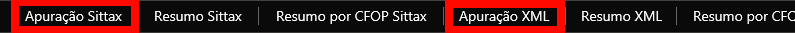

# Dados do Escritório

## Dados

\
Na aba "Dados", dentro de "Dados do Escritório", são exibidos todos os dados principais do escritório, como CNPJ, nome, UF, nome fantasia, município, e-mail, data de criação no SITTAX e telefone do escritório.

<figure><figcaption></figcaption></figure>

Aqui é possível alterar o nome fantasia, E-mail e telefone do escritório.

## E-mails

Nesse painel, é possível acessar a configuração e parametrização dos e-mails automáticos.

### O que enviar:

<figure><figcaption></figcaption></figure>

**Seção "O que enviar"**

Nesta seção, você pode configurar quais relatórios serão enviados por e-mail automaticamente. Você pode selecionar quais relatórios deseja que sejam enviados, ativando ou desativando cada opção com os interruptores disponíveis. Esta funcionalidade é útil para manter a equipe informada e garantir que os documentos necessários sejam sempre enviados e recebidos de maneira automatizada.

**Tipos de Relatórios e Descrições**

* **DAS**: Guia gerada no PGDAS para o pagamento do imposto.
* **EXTRATO**: Extrato da declaração enviada ao PGDAS para conferência da declaração.
* **FATURAMENTO**: Declaração do faturamento dos últimos 12 meses.
* **CERTIDÕES**: Certidões negativas estaduais e federais.
* **CONFERÊNCIA**: Relatório analítico com as notas declaradas na apuração.
* **CONFERÊNCIA DIFAL**: Relatório analítico com as notas interestaduais.
* **QUEBRA DE SEQUÊNCIA**: Relatório analítico dos problemas que houveram na apuração.
* **GUIA DIFAL**: Guia gerada para o pagamento do DIFAL.

### Apuração:

Nesta seção, você configura o e-mail para envio automático dos dados da apuração. Esta funcionalidade é essencial para garantir que os dados apurados sejam enviados corretamente aos destinatários, mantendo-os informados e facilitando a conferência das informações.

<figure><figcaption></figcaption></figure>

Inicialmente, um campo para a digitalização do corpo do e-mail será apresentado, nele usando as ferramentas do cabeçalho, é possível digitalizar conforme desejado, além de anexar imagens com a logo ou mensagens que irão compor o corpo do e-mail.

A digitação do e-mail se dá por meio de tags que irão processar o que será enviado para o cliente final, elas são:

Campos de Personalização:

* **{NOME\_CLIENTE}**: Inserir o nome do cliente.
* **{MES}**: Inserir o mês da apuração.
* **{numeroDareGuiaRevenda}**: Inserir o número da guia de revenda.
* **{numeroDareGuiaUsoConsumoImobilizado}**: Inserir o número da guia de uso/consumo imobilizado.
* **{arquivoZip}**: Inserir o link para o arquivo zip com os dados da apuração.

Exemplo de Texto do E-mail:

"Olá, {NOME\_CLIENTE}. A apuração do mês {MES} foi transmitida. Acesse o arquivo abaixo: {arquivoZip}"\
\
&#xNAN;_&#x4C;embrando que a digitalização das tags tem que ser exatamente como mostrado no exemplo_.

Após finalizar as configurações e digitações, recomendamos que utilize os testes de e-mail para verificar como será exibido para o seu cliente.

#### Testes

* **Teste de e-mail**: Permite enviar um e-mail de teste para verificar se a configuração está correta, será enviado para o e-mail que está informado no cadastro do escritório.
* **Teste de e-mail download**: Envia um e-mail de teste com opção de download para verificar a funcionalidade de anexos para o e-mail no cadastro do escritório

### Faturamento:

Nesta seção, você configura o e-mail para envio automático dos dados do faturamento do cliente. Esta funcionalidade é essencial para garantir que a apuração do faturamento seja enviado corretamente aos destinatários, mantendo-os informados e facilitando a conferência das informações.

<figure><figcaption></figcaption></figure>

Inicialmente, um campo para a digitalização do corpo do e-mail será apresentado, nele usando as ferramentas do cabeçalho, é possível digitalizar conforme desejado, além de anexar imagens com a logo ou mensagens que irão compor o corpo do e-mail. A digitação do e-mail se dá por meio de tags que irão processar o que será enviado para o cliente final, elas são:

* **{nomeEmpresa}**: Inserir o nome da empresa do cliente.
* **{MES}**: Inserir o mês do faturamento.
* **{cnpj}**: Insesir o CNPJ da empresa do cliente.\

Logo abaixo, é possível anexar uma imagem de cabeçalho para o E-mail, uma imagem de assinatura e uma de rodapé, basta clicar em selecionar e enviar após a seleção.

Após finalizar as configurações e digitações, recomendamos que utilize os testes de e-mail para verificar como será exibido para o seu cliente.

#### Testes

* **Teste de e-mail**: Permite enviar um e-mail de teste para verificar se a configuração está correta, será enviado para o e-mail que está informado no cadastro do escritório.
* **Teste de e-mail download**: Envia um e-mail de teste com opção de download para verificar a funcionalidade de anexos para o e-mail no cadastro do escritório.

## Certificado

Neste painel, é possível adicionar o certificado digital do escritório. No início do painel, você encontrará uma visualização dos certificados ativos na base (Item 1), que descreve a data de importação e a data de validade do certificado (A1).

<figure><figcaption></figcaption></figure>

**Passos para Adicionar um Novo Certificado**

1. **Importar Certificado**:
   * Clique no botão central "Importe seus arquivos" (Item 2).
   * Um menu de busca será aberto para que você possa procurar o arquivo desejado dentro do seu computador.
   * **Lembrando:** A estrutura do nome do certificado deve incluir a senha, da seguinte maneira: `nome senha123.pfx`.
2. **Listagem e Envio do Certificado**:
   * Após adicionar o certificado, ele ficará listado como pendente para aprovação (Item 3).
   * Para enviar o certificado para o sistema, clique nos botões laranjas "Enviar" ou "Enviar todos".

## Sócios:

Nessa tela é possível cadastrar os sócios desse escritório, essa função é extremamente importante para escritórios que utilizam certificados por procuração em cliente onde o certificado digital usado será o de pessoa física do Sócio. Nesse caso, após cadastrar o sócio é possível importar o certificado dele no menu "Certificados" dentro do cadastro do escritório.\
\
Ao abrir o menu "Sócios" a seguinte tela poderá ser visualizada:

<figure><figcaption></figcaption></figure>

Para cadastrar um sócio, basta clicar em "Adicionar Sócio", preencher o nome, o CPF e clicar no botão laranja "Salvar".

## Configurações:

No menu de configurações, é possível ativar e desativar avisos, notificações, tipo de pesquisa e o fuso horário. Ao clicar nessa função, o seguinte painel será mostrado:\

<figure><figcaption></figcaption></figure>

* **Notificação de Quebra de Sequência**:  Ao marcar esta opção, você será notificado quando empresas vinculadas a este escritório apresentarem quebra de sequência.
* **Data de Entrada Automática**: Ao ativar, sempre será considerada a data de emissão da nota ao importar.
* **Aviso de Erros no Certificado**: Ao marcar esta opção, você receberá avisos sobre o vencimento do certificado.
* **Pesquisa por Razão Social**: Ao ativar esta funcionalidade, será possível buscar empresas pelo nome da razão social.

## SIEG

Neste painel, é possível configurar a integração do Sittax com o serviço do SIEG, permitindo que as notas de saída e de entrada sejam importadas automaticamente para o sistema. Ao acessar este painel, siga os passos abaixo para realizar a configuração:

<figure><figcaption></figcaption></figure>

**1. Acesse a aba "Configurações"**\
Na tela **Dados do Escritório**, clique no botão **Configurações** localizado na parte superior da seção.

<figure><figcaption></figcaption></figure>

**2. Preencha os dados de integração SIEG**\
Na janela **Serviços**, insira as informações obrigatórias:

* **API Key SIEG**
* **E-mail SIEG**
* **Senha SIEG**

**3. Clique em "Salvar"**\
Após preencher os campos corretamente, finalize clicando no botão **Salvar** para concluir a configuração.
