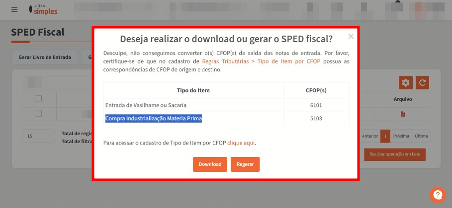

# Notas emitidas com CFOP incorreto impactando o Anexo. Como corrigir?

Esta seção tem como objetivo orientar o que fazer quando o cliente emite notas fiscais com **CFOPs incorretos**, resultando na **apuração no Anexo errado** dentro da ferramenta.

Se a empresa emite **poucas notas fiscais por mês**, é possível ajustar os CFOPs manualmente através do módulo indicado no FAQ:

(COLOCAR F.A.Q Como posso alterar o CFOP da nota fiscal?)

Já para empresas com **grande volume de notas**, o ideal é utilizar a tela **Configuração de Anexo**, que permite **relacionar e corrigir os CFOPs** para que sejam tributados no **Anexo correto**.

### Procedimento passo a passo:

1. **Identifique os CFOPs incorretos**\
   Antes de ajustar, acesse o **Relatório de Conferência** e verifique, na coluna **“CFOP da nota”**, quais foram emitidos incorretamente.\
   (COLOCAR F.A.Q Como analisar o Relatório de Conferência?)
2. Acesse a tela de Configuração de Anexo\
   Entre em **Dados da Empresa > Configuração de Anexo**.
3. **Selecione o Anexo correto**\
   Dentro da aba **Configuração de Anexo,** no primeiro campo “Anexo”, escolha o **Anexo que deveria estar sendo utilizado** na apuração da empresa.
4. **Associe os CFOPs incorretos**\
   No campo ao lado, insira os **CFOPs que foram emitidos de forma incorreta**, para que passem a tributar no Anexo correto.
5. **Salve as alterações**\
   Clique em **“Salvar”** para confirmar a configuração.

<figure><figcaption></figcaption></figure>
