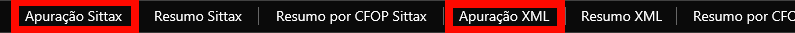

# Relatório de Conferência - Novidade

## Alterações no Relatório de Conferência

### 1. Contexto da Mudança

Anteriormente, o relatório de conferência era disponibilizado em uma única planilha de Excel contendo duas abas. Nessas abas, os cálculos realizados pela plataforma nas modalidades XML e Sittax eram apresentados de forma mesclada.

<figure><figcaption></figcaption></figure>

Esse formato gerava alta complexidade na análise, pois reunia grande volume de informações em um único local. Como consequência, usuários frequentemente precisavam realizar diversas manipulações manuais na planilha para conseguir visualizar apenas os dados relevantes para sua conferência.

A partir de feedbacks recorrentes de clientes, identificou-se a necessidade de reestruturar o relatório para melhorar a clareza, reduzir o esforço manual e facilitar o processo de conferência.

***

### 2. Objetivo do Novo Modelo

O novo modelo foi desenvolvido com foco em:

* Aumentar a clareza na conferência dos dados
* Reduzir a necessidade de manipulação manual
* Melhorar a organização das informações
* Facilitar análises comparativas e auditorias
* Tornar o relatório mais compatível com uso em ferramentas de IA

Embora ainda permita edições manuais por parte do cliente, o novo formato reduz significativamente essa necessidade, oferecendo uma estrutura mais organizada e pronta para uso.

***

### 3. Facilidade no Uso com IAs

Com o crescimento do uso de ferramentas de Inteligência Artificial por clientes para validação de dados, o novo modelo foi estruturado para facilitar esse tipo de utilização.

A separação clara das informações evita ambiguidades, melhora a legibilidade dos dados e permite uma navegação mais eficiente, tornando o relatório mais adequado para processamento e análise por essas ferramentas.

***

### 4. Estrutura do Novo Relatório

O novo relatório passa a priorizar a clareza da conferência, separando as informações por tipo de apuração e permitindo melhor rastreabilidade dos valores.

<figure><figcaption></figcaption></figure>

#### 4.1 Apuração Sittax

Nesta seção, são apresentadas todas as informações relacionadas à emissão das notas fiscais com base na apuração realizada pelo Sittax.

<figure><figcaption></figcaption></figure>

Inclui:

* Dados da nota fiscal
* Itens e estrutura dos produtos
* Classificações fiscais (NCM, CEST, CFOP da nota)
* CFOP utilizado para correção
* Informações completas de cálculo

São mantidos todos os dados anteriormente disponíveis, incluindo:

* Alíquotas efetivas
* Alíquotas de ICMS
* PIS/COFINS
* Bases legais
* Valores de CPP, IRPJ, entre outros

A principal melhoria está na organização e detalhamento dessas informações.

***

#### 4.2 Apuração XML

A Apuração XML apresenta o detalhamento completo dos cálculos realizados a partir dos dados da própria XML.

<figure><figcaption></figcaption></figure>

Essa seção permite:

* Visualização detalhada da apuração
* Comparação direta com a apuração Sittax
* Suporte a processos de auditoria

Mesmo sendo um relatório de conferência, a estrutura permite validações profundas do processo de cálculo.

***

#### 4.3 Resumo Sittax e Resumo XML

Nesta seção, os dados são consolidados para facilitar a análise geral da tributação.

<figure><figcaption></figcaption></figure>

São apresentados os seguintes agrupamentos:

* ICMS Tributado e PIS/COFINS Tributado
* ICMS Tributado e PIS/COFINS Monofásico
* ICMS ST e PIS/COFINS Tributado
* ICMS ST e PIS/COFINS Monofásico

Esse resumo foi projetado para:

* Facilitar a conferência geral
* Apoiar validações com os resumos por acumulador do sistema Domínio
* Auxiliar na identificação de inconsistências

Adicionalmente, são listados os NCMs de devolução, contribuindo para configurações e validações no Domínio.

***

#### 4.4 Resumo por CFOP (Sittax e XML)

<figure><figcaption></figcaption></figure>

Apresenta a distribuição do faturamento por CFOP.

Permite:

* Analisar o percentual de faturamento por CFOP
* Comparar Sittax e XML
* Validar o tratamento fiscal aplicado

Essa visão simplifica auditorias rápidas e validações operacionais.

***

#### 4.5 Notas Não Calculadas

<figure><figcaption></figcaption></figure>

Seção dedicada às notas que não foram calculadas na operação.

Essa informação é importante para:

* Identificar lacunas no processamento
* Garantir integridade da conferência
* Apoiar investigações de inconsistências

***

### 5. Principais Benefícios

* Redução significativa de esforço manual
* Maior clareza e organização dos dados
* Melhor suporte a auditorias
* Facilidade de uso com ferramentas de IA
* Estrutura mais intuitiva para o usuário final 

### 6. Auditoria

Uma das formas mais funcionais de realizar auditoria dos produtos, é realizando a redução dos produtos sendo visualizados na plataforma. O relatório de conferência trás os produtos por incidência, ou seja, um produto vendido 100 vezes terá 100 linhas repetidas referente às suas apurações. Dessa forma, podemos usar o próprio excel para evidenciar de forma melhor uma Auditoria dos Produtos:

<figure><figcaption></figcaption></figure>

1. Selecione todos as linhas e colunas do relatório;
2. Vá em DADOS;
3. clique no ícone "REMOVER DUPLICADAS";
4. Anule todas as seleções e selecione as opções "Código do Item" e "Descrição do Item" apenas;
5. Pronto, você terá um relatório enxuto que tratá apenas um exemplar de cada produto.

***

### 6. Conclusão

A reformulação do relatório de conferência representa um avanço importante na usabilidade e eficiência da plataforma.

A nova estrutura atende diretamente às dores dos usuários, proporcionando uma experiência mais clara, confiável e alinhada às necessidades atuais de análise e validação de dados.
